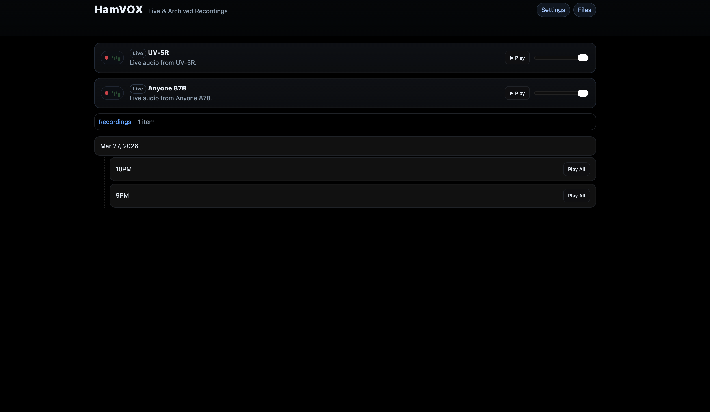
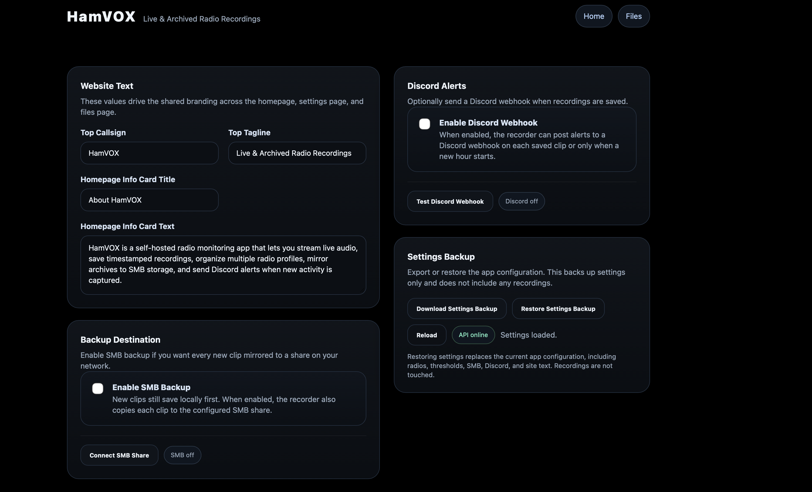
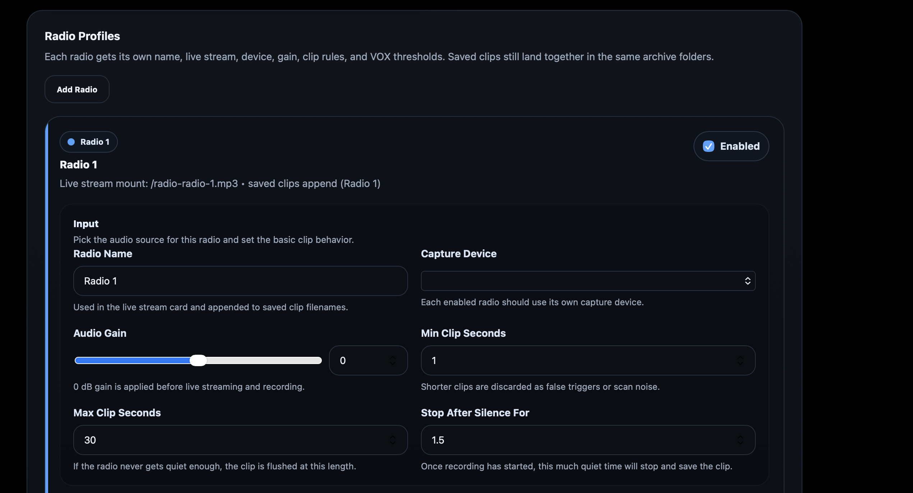
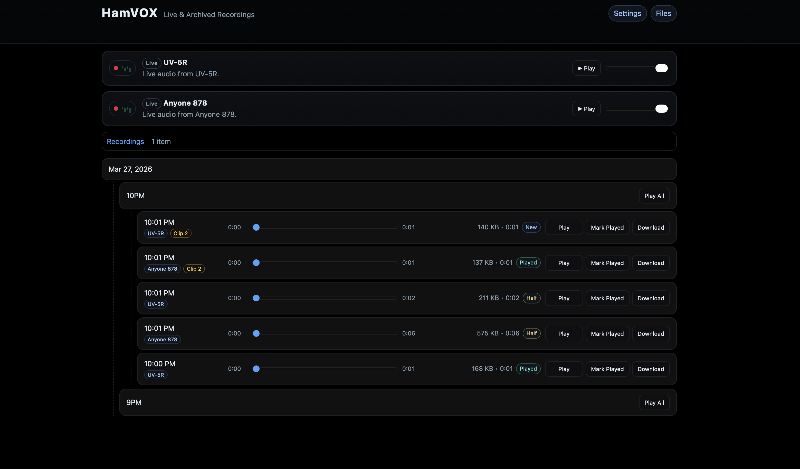
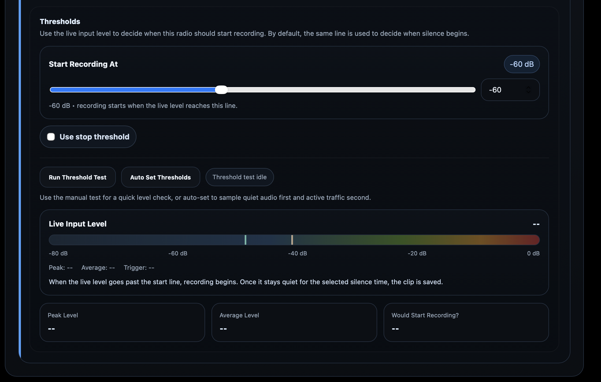

# HamVOX

HamVOX is a self-hosted radio recorder for Docker-based Ubuntu installs. Plug a ham radio or scanner audio output into your computer, then use HamVOX to stream live audio, save timestamped recordings, manage multiple radios, and control everything from a web UI.

## Screenshots



| Settings | Radio Settings |
|---|---|
|  |  |

| Homepage View 2 | Threshold Meter |
|---|---|
|  |  |

## Features

- Live audio streaming with bundled Icecast
- Timestamped WAV recording
- Multiple radio profiles with separate device, gain, and recording behavior
- Web UI for live listening, playback, settings, and file management
- Optional SMB mirroring for new recordings
- Optional Discord alerts
- Settings backup and restore

## Install

### 1. Copy the project

```bash
cd /home/user
git clone https://github.com/K1NJS/HamVOX.git
cd HamVOX
```

Or copy the folder over manually.

### 2. Create the env file

```bash
cp .env.example .env
```

### 3. Review `.env`

You usually only need to review:

- `HAMVOX_RECORDINGS_ROOT_HOST`
- `HAMVOX_TIMEZONE`
- `HAMVOX_ADMIN_USERNAME`
- `HAMVOX_ADMIN_PASSWORD`
- `HAMVOX_PROTECT_PUBLIC`
- `ICECAST_HOSTNAME`
- `ICECAST_SOURCE_PASSWORD`
- `ICECAST_ADMIN_PASSWORD`

### 4. Start HamVOX

```bash
docker compose up -d --build
```

### 5. Open the app

- Homepage: `http://localhost:8080/`
- Icecast status: `http://localhost:8000`

## Environment Variables

HamVOX uses `.env` for startup, storage, auth, and Icecast defaults. Most day-to-day radio settings are managed in the web UI and saved in the app settings file.

### App and storage

- `HAMVOX_APP_HOST`
- `HAMVOX_APP_PORT`
- `HAMVOX_RECORDINGS_ROOT_HOST`
- `HAMVOX_RECORDINGS_ROOT`
- `HAMVOX_ARCHIVE_ROOT`
- `HAMVOX_SETTINGS_PATH`
- `HAMVOX_TIMEZONE`

### Admin access

- `HAMVOX_ADMIN_USERNAME`
- `HAMVOX_ADMIN_PASSWORD`
- `HAMVOX_PROTECT_PUBLIC`

Behavior:

- if `HAMVOX_ADMIN_PASSWORD` is blank, nothing is protected
- if a password is set and `HAMVOX_PROTECT_PUBLIC=false`, only `/settings` and `/files` are locked
- if a password is set and `HAMVOX_PROTECT_PUBLIC=true`, the homepage is locked too

## Using HamVOX

### Homepage

The homepage is for:

- live listening
- browsing recordings
- inline playback

If multiple radios are enabled, each radio gets its own live stream card.

### Settings

The Settings page lets you manage:

- site branding text
- SMB backup
- Discord alerts
- settings backup and restore
- radio profiles

Each radio profile can have its own:

- radio name
- capture device
- gain
- minimum clip length
- max clip length
- start threshold
- silence stop time
- optional stop threshold

### Thresholds

By default, HamVOX uses a simple recording model:

- `Start Recording At`
- `Stop After Silence For`

Recording starts when audio rises above the start line, then stops after the audio stays quiet long enough. If needed, `Use stop threshold` exposes a separate stop line for advanced tuning.

### SMB Backup

When SMB backup is enabled:

- recordings still save locally first
- each new clip is also copied to the configured SMB share

### Discord Alerts

Discord alerts can be sent:

- for every saved recording
- or only when a new hour folder gets its first clip

Message templates support:

- `{radio_name}`
- `{path}`
- `{length}`

### Settings Backup

HamVOX can export and restore its configuration from the Settings page. This backs up settings only and does not include recordings.

## Archive Layout

Recordings are saved into date and hour folders, for example:

```text
Mar27-2026/7PM/
```

Files include the radio name and duplicate count when needed, for example:

```text
7_29PM UV-5R.wav
7_29PM (1) UV-5R.wav
7_29PM Anytone.wav
```
